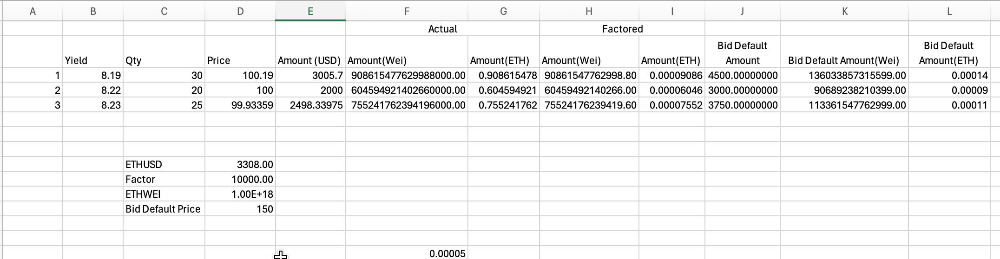
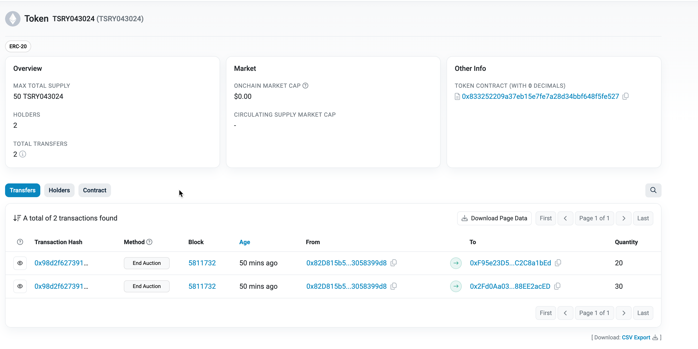
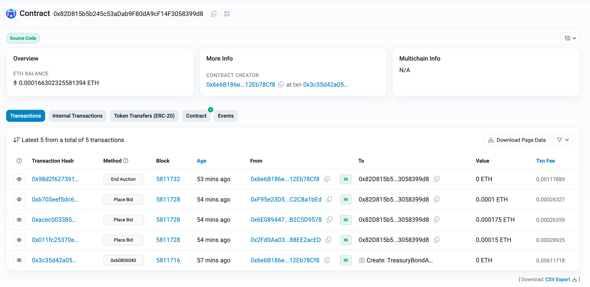
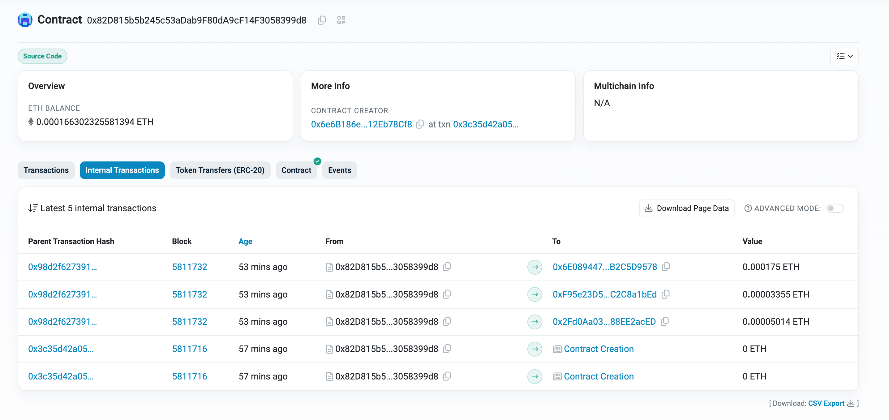
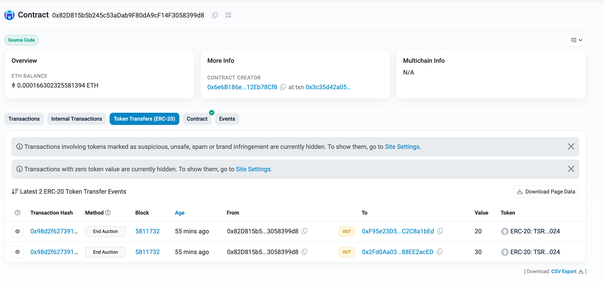

# Treasry Bond Auction on Chain

## Abstract:

- Treasury uses computer application called TAAPS (Treasury Automated Auction Processing System)
- Market participants use TAPS to place their bids, at the end of auction the results are posted on Treasury Department Bureau of public debt website.

## Auction Process

The Treasury auction process begins with an announcement by the Treasury that it will soon auction a specified quantity of a particular security. Immediately following the announcement of a forthcoming auction, dealers and other market participants begin to trade the new security on a when-issued basis. Secondary market transactions in outstanding Treasury securities typically settle on the business day after the trade date, when sellers deliver securities to buyers and receive payment. When-issued trading enables market participants to contract for the purchase and sale of a new security before the security has been auctioned. When-issued trading contributes to the Treasury’s goal of promoting competitive auctions by enhancing market transparency.

Auction market participant can submit either (a) one or more competetive bids, each specifying a minimum yeild at which the participant is prepared to by a specified quantity of notes or (b) a single noncompetitive bid, specifying the quantity of securities that it is prepared to buy at whatever price is paid by successful competitive bidders.

Treasury conducts note auctions in a "single-price" format i.e, same coupon rate for all accepted bids . After the close of bidding, it subtracts the noncompetitive 2bids from the total quantity of securities offered and then accepts competitive bids,in order of increasing yield,until it has exhausted the offering. The highest accepted yield is called the “stop.” Bids specifying yields below the stop are filled in full, bids above the stop are rejected, and bids at the stop are filled on a pro rata basis.6 All auction awards are made at a single price, computed from the yield at which the auction stopped.

## Settlement Cycles

## Auction on chain



- Build the auction infrasture on the chain

- Token TSRY043024



- Bond Auction Contract







Treasury issues the security T+5 from the auction date.

Contract Hash: 0xEFE2eC15ed01ffECb037792B3601F5645ae89c9a
https://sepolia.etherscan.io/address/0xEFE2eC15ed01ffECb037792B3601F5645ae89c9a

Contract Hash: 0x82D815b5b245c53aDab9F80dA9cF14F3058399d8
https://sepolia.etherscan.io/address/0x82D815b5b245c53aDab9F80dA9cF14F3058399d8

```shell
npx hardhat help
npx hardhat test
REPORT_GAS=true npx hardhat test
npx hardhat node
npx hardhat ignition deploy ./ignition/modules/TreasuryBondAuction.ts --network localhost --reset

hh run scripts/PlaceBid.ts --network localhost

npx hardhat ignition deploy ./ignition/modules/TreasuryBondAuction.ts --network sepolia --reset --verify
hh run scripts/PlaceBid.ts --network sepolia
hh run scripts/EndAuction.ts --network sepolia
hh run scripts/CancelAuction.ts --network sepolia
```

```r
findPriceInWei<-function(qty,price,factor=100,ethUsd=3308){
   ((qty*price) * 1e18)/ethUsd/factor
}

derivedPrice<-function(bidYield,maturityInYears,couponRate){
    r = (100 + bidYield) * maturityInYears;
    return ((couponRate * 100) / bidYield) * 100 * (10000 - (1e24 / r)) + 1e28 / r;
}

derivedPrice<-function(bidYield,maturityInYears,couponRate){
  r = (10000 + bidYield) ^ maturityInYears;
  a= ((couponRate * 100) / bidYield) * 100 * (10000 - (1e44 / r))
  b= 1e48 / r
  return( a + b );
}

findPriceInWei<-function(qty,price,factor=10000,ethUsd=3308){
  ((qty*price) * 1e18)/ethUsd/factor
}

derivedPrice<-function(bidYield,maturityInYears,couponRate){
  r = (1 + bidYield/100) ^ maturityInYears;
  a= (couponRate / bidYield) * 100 * (1 - (1 / r))
  b= 100 / r
  return( a + b );
}
```

## Conclusion

References:

- https://www.newyorkfed.org/medialibrary/media/research/current_issues/ci11-2.html
- https://www.treasurydirect.gov/auctions/upcoming/
- https://github.com/PatrickAlphaC/hardhat-fund-me-fcc
- https://github.com/brynbellomy/solidity-auction/blob/master/contracts/Auction.sol
- https://www.youtube.com/watch?v=LlgajyUiLBs
